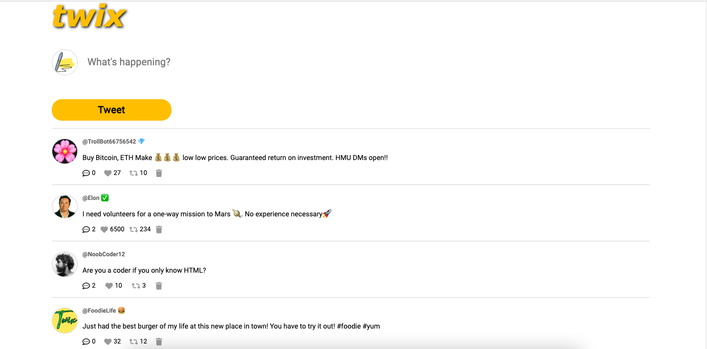
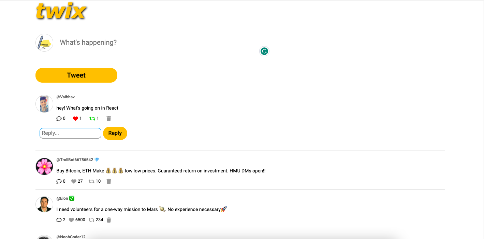

# Twix

## Description

Twix is a simple Twitter-like web application that allows users to post and interact with tweets. It provides features such as liking, retweeting, replying, deleting tweets and save to localStorage.

## Features

- Post a tweet
- Like a tweet
- Retweet a tweet
- Reply to a tweet
- Delete a tweet
- Save to localStorage

## Technologies Used

- HTML
- CSS
- JavaScript

## Usage

1. Clone the repository: `git clone- ( https://github.com/vaibhavt896/twix )
2. Open the index.html file in your web browser.
3. Start interacting with the app by posting tweets, liking, retweeting, and replying to tweets.

## Screenshots

## Contributing

Contributions are welcome! Please create a pull request with your proposed changes.

## License

This project is licensed under the [MIT License](LICENSE).

## Acknowledgements

This project was created with the help of the Scrimba platform. Additional features and enhancements were added to personalize the app.

## Contact

For any questions or inquiries, please contact me at (mailto:tiwarvaibhav997@gmail.com).

---

I made this project as part of my learning journey, and it showcases my understanding of HTML, CSS, and JavaScript fundamentals. I'm excited to share this with the community and welcome any feedback or suggestions for improvement.

You can also find the live version of this project deployed on GitHub Pages. Feel free to explore and enjoy!

[Live Demo](https://lnkd.in/dhibrhS5)

Enjoy tweeting with Twix!
